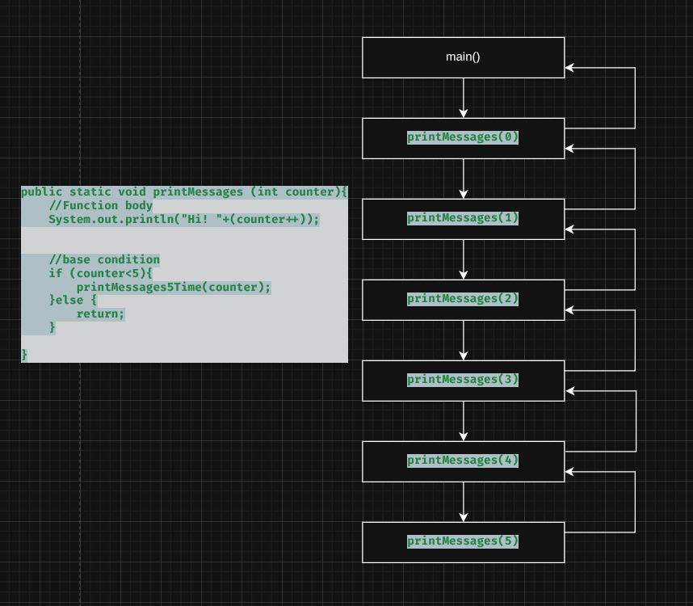

Of course! Here is a nicely rephrased and structured explanation of function recursion and its internal workings.

---

### Function Recursion

Function recursion is a powerful programming technique where a function calls *itself* in order to break down a complex problem into smaller, more manageable sub-problems of the same type. This approach is often used for tasks that can be defined in terms of similar, smaller tasks, such as traversing tree structures, calculating factorials, or generating sequences.

### Internal Workings: The Call Stack

The mechanism that makes recursion possible is the call stack. Here’s how it works:

*   Stack-Based Execution: Java manages function calls using a stack data structure. Whenever a function is called, a new stack frame is allocated in memory. This frame contains the function's parameters, local variables, and the return address.
*   LIFO Principle: The call stack operates on a Last-In, First-Out (LIFO) basis. The most recently called function is the first one to complete and be removed from the stack.
*   Nested Calls: When a function, during its execution, calls another function (including itself), the new call is placed *on top* of the current one in the stack. The original function's execution is temporarily paused until the new function call completes.
*   Unwinding the Stack: As each function finishes its task, its stack frame is popped from the stack, freeing the memory. The program then resumes execution from the point where it was paused in the previous function.

### The Entry Point: The `main` Function

The execution of any Java program begins with the `main` function. This initial call is the first frame pushed onto the call stack. The program concludes when the `main` function finishes and its frame is popped off, leaving the stack empty.

In a recursive process, a function will repeatedly push new copies of itself onto the stack until a base case (a condition that stops the recursion) is reached. The stack then "unwinds" as each function call returns its result to the caller below it. Each recursive function call in Java gets its own, separate set of memory accesses on the call stack. And in stack gets filled with newer function block.

In case, there is no exit condition specified or getting hit by function executing then a infinite number of calls flud the call stack, which can lead to stack overflow condition.

In recursion there is always (n + 1 ) iteration and last iteration hits the exit condition.
```java

package DSA.JD08_Recursion;

public class PT01_BasicFunctionRecursion {
    static void main() {
        printMessages5Time(0);
    }


    public static void printMessages5Time (int counter){
        //Function body
        System.out.println("Good Morning Meghsham !!! "+(counter++));


        //base condition
        if (counter<5){
            printMessages5Time(counter);
        }else {
            return;
        }

    }
}

```




## Why Recursion?
- It helps us solving bigger and complex problem in a simpler way.
- You can convert recursion solution into iteration & vice versa.
- Space Complexity is not constant as  higher as more and more recursive calls are made.
- 


# Recurrence Notes

## 1. What is Recurrence?
**Recurrence** = When a function calls itself repeatedly
- Fundamental concept in recursion
- The "self-repeating" pattern in recursive algorithms

**Example:**
```java
int factorial(int n) {
    return n * factorial(n-1);  // This is recurrence
}
```

## 2. What is Recurrence Relation?
**Recurrence Relation** = Mathematical equation that describes the time complexity of recursive functions

**Format:**
```
T(n) = a × T(n/b) + f(n)
```

**Components:**
- `T(n)` = Time for input size `n`
- `a` = Number of recursive calls
- `n/b` = Size of subproblems
- `f(n)` = Work done outside recursion

## 3. Types of Recurrence Relations

### **Type 1: Divide and Conquer**
Problem divided into equal smaller parts
```
T(n) = aT(n/b) + f(n)
```
**Examples:**
- Binary Search: `T(n) = T(n/2) + 1`
- Merge Sort: `T(n) = 2T(n/2) + n`

### **Type 2: Linear Decrease**
Problem size reduces by constant amount
```
T(n) = T(n-1) + f(n)
```
**Examples:**
- Factorial: `T(n) = T(n-1) + 1`
- Linear Search: `T(n) = T(n-1) + 1`

### **Type 3: Multiple Branches**
Multiple recursive calls with overlapping subproblems
```
T(n) = aT(n-1) + bT(n-2) + f(n)
```
**Examples:**
- Fibonacci: `T(n) = T(n-1) + T(n-2) + 1`
- Tower of Hanoi: `T(n) = 2T(n-1) + 1`

## 4. Quick Identification Guide

| Pattern              | Recurrence Type | Speed       |
|----------------------|-----------------|-------------|
| Problem halves       | `T(n/2)`        | Fast        |
| Problem reduces by 1 | `T(n-1)`        | Medium/Slow |
| Multiple calls       | `aT(n/b)`       | Can be slow |

## 5. Key Points to Remember

- **Recurrence** = The act of function calling itself
- **Recurrence Relation** = Math formula for its time complexity
- **Types** = Based on how problem size reduces

**Rule of Thumb:** The faster the problem size reduces, the more efficient the recursion!